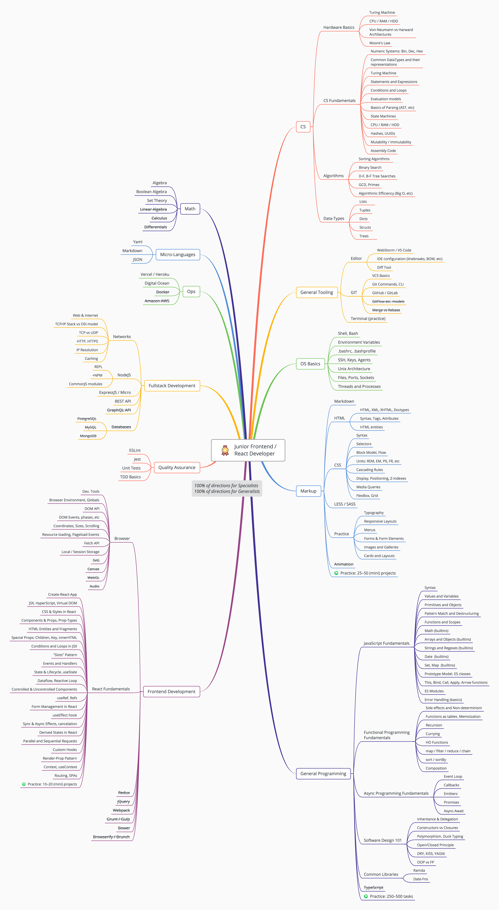

# Frontend / React Developer Mindmaps 
 
*Note: work in progress...*

## Mindmaps

1. [**Intern Frontend Developer**](intern.png?raw=true) (image, updated for 2022)
2. [**Junior Frontend Developer**](junior.png?raw=true) (image, 2020)
3. [**Middle Frontend Developer**](middle.png?raw=true) (image, 2020)
4. [**Senior Frontend Developer**](senior.png?raw=true) (image, 2020)

## Recommendations

#### 1. Isolate Topics

It's much easier to learn topics in isolation. I recommend to avoid courses that couple multiple areas together.
If some program, for example, promises to teach you JavaScript, Markup, Async Programming, Performance, Security, etc.
in parallel... you should avoid it like a plague. Such approach, btw, is common at Udemy and is the reason I don't generally 
recommend this platform (though it has some great courses). Ideally, you should practice each topic immediately 
after the theory. Longer series delay practice, which makes you forget what you've learned.

#### 2. ...

TODO

## License

[**CCA 3.0**](https://creativecommons.org/licenses/by/3.0/deed.en)

(Free to share and modify. **Attribution required**)

--- 

Please ★ this repo to support our work!
