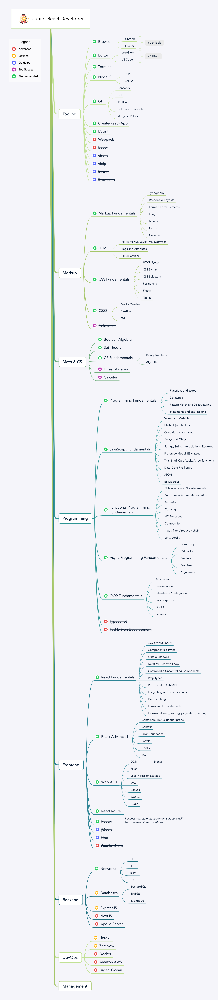

# Junior React Developer Roadmap 2019

#### Side Notes

**Platforms:** I recommend PluralSight, EggHead, FrontendMasters, and LevelUP Tutorials. Either the content they deliver is exlusively great or they have course ratings you can actually trust. EggHead's format works better for smaller, more focused topics while PluralSight & FrontendMasters really shine for larger and general topics. Each course at LevelUP Tutorials is brilliant i.m.o. so I would check it the first if you're interested in React or GraphQL. Otherwise, if you want to learn a library (Redux?) – go for EggHead. If you want to learn some fundamentals – go for PluralSight or FrontendMasters. There are many gems of content at other platforms indeed, but, as paying for multiple subscriptions is a waste, I prefer to stick to the limited *trusted* set. Udemy, in particular, was noticed to use some really bad practices: content stealing, rating manipulations, etc. I suggest to avoid this platform alltogether.

**Subject Isolation:** it's easier to learn everything in isolation. I suggest you to avoid courses that conflate many subjects.
If series, for example, attempts to teach you JavaScript, Markup, Async Programming and who-knows-what in one run – you should avoid it like a plague. Such approach, btw, is common at Udemy and is another reason I don't recommend this platform. Ideally, you should practice each topic immediately after the theory. Longer series delay practice, which makes you forget what you learned as a result.

---

Now, to help you further, for each topic I picked the sources I personally consider the best. Obviously they rarely have 100% coincidience with the above topic layout. Some cover more than I would do, some – less. Whatever, everyone's vision is unique and it's great. I strongly believe that you should learn from multiple authors.

## Markup

### CSS3

* [Flexbox Fundamentals](https://egghead.io/courses/flexbox-fundamentals) (EggHead)

## Math & CS

* [Boolean Algebra](https://www.youtube.com/watch?v=gj8QmRQtVao) (YouTube)
* [Intro to Discrete Math](https://www.youtube.com/watch?v=tyDKR4FG3Yw&list=PLDDGPdw7e6Ag1EIznZ-m-qXu4XX3A0cIz) (YouTube)
* [Algorithms](https://github.com/trekhleb/javascript-algorithms) (GitHub)

## Programming

### Programming Fundamentals

* [Learning To Program](https://www.pluralsight.com/courses/learning-programming-javascript) (PluralSight) OR [Programming Basics](https://www.pluralsight.com/courses/javascript-programming-basics) (PluralSight)
* [Regexes in JavaScript](https://egghead.io/courses/regex-in-javascript) (EggHead)

### EcmaScript

* [JavaScript Foundations](https://frontendmasters.com/courses/javascript-foundations/) (FrontendMasters)
* [Understanding Prototypal Inheritance](https://egghead.io/courses/understanding-javascript-s-prototypal-inheritance) (EggHead)

### Functional Programming

* [FP Fundamentals](https://www.pluralsight.com/courses/javascript-functional-programming-fundamentals) (PluralSight)
* [FP Lite](https://www.pluralsight.com/courses/functional-lite-javascript) (PluralSight) OR [FP Lite](https://frontendmasters.com/courses/functional-javascript-v2/) (FrontendMasters)
* [FP With Ramda](https://www.pluralsight.com/courses/javascript-ramda-functional) (PluralSight)

### Asynchronous Programming

* [JS Promises in depth](https://egghead.io/courses/javascript-promises-in-depth) (EggHead)
* [Async JS with async-await](https://egghead.io/courses/asynchronous-javascript-with-async-await) (EggHead)
* [Rethinking Async JS](https://frontendmasters.com/courses/rethinking-async-js/) (FrontendMasters) OR [Rethinking Async JS](https://www.pluralsight.com/courses/rethinking-asynchronous-programming) (FrontendMasters)
* [Reasoning about Async JS](https://www.pluralsight.com/courses/asynchronous-javascript-reasoning) (PluralSight)
* [Modern Async JS](https://www.pluralsight.com/courses/javascript-asynchronous-modern) (PluralSight) (move to advanced?)

### React

* [React 16 for everyone](https://www.leveluptutorials.com/tutorials/react-16-for-everyone) (LevelUP)
* [Beginner's guide to React](https://egghead.io/courses/the-beginner-s-guide-to-react) (EggHead)
* [Start Learning React](https://egghead.io/courses/start-learning-react) (EggHead)

### React-Router

* [React Router v4](https://egghead.io/courses/add-routing-to-react-apps-using-react-router-v4) (EggHead)

### Networks

* [HTTP Fundamentals](https://www.pluralsight.com/courses/xhttp-fund) (PluralSight) OR [HTTP Basics](https://www.pluralsight.com/courses/xhttp-fund) (EggHead)

---

Each ★ motivates us to keep updating ;)
